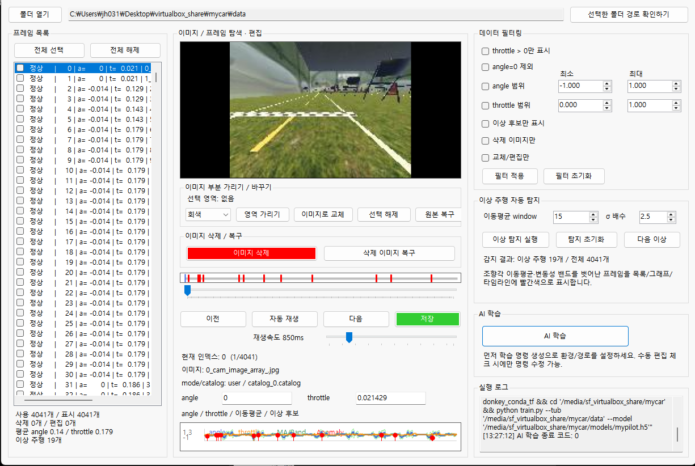
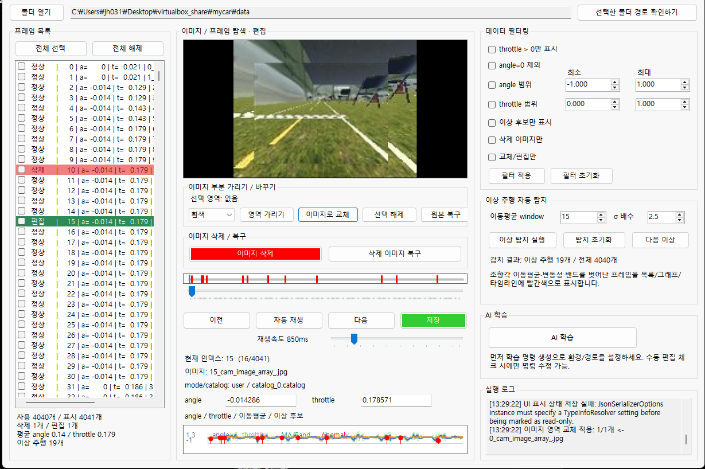
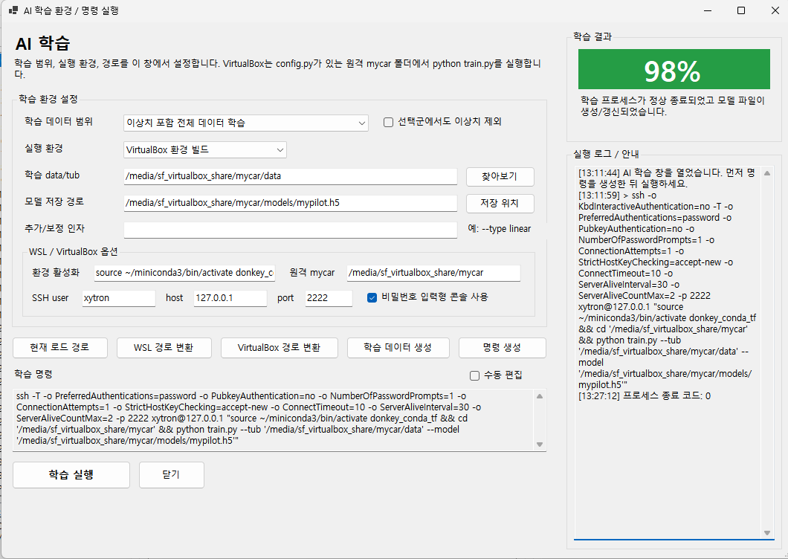

# DonkeyCar UI 데이터 관리 도구

> C# WinForms로 DonkeyCar 학습 데이터를 확인·정제·전처리하고, Windows/WSL/VirtualBox 환경에 맞는 Python 학습 명령을 생성·실행하는 통합 데이터 관리 프로그램입니다.

이 프로젝트는 DonkeyCar의 `catalog`, `manifest`, `images` 데이터를 사람이 직접 확인하기 쉽게 보여주고, 불량 데이터 삭제, 이미지 마스킹/교체, 캐니에지 전처리 미리보기, 이상 주행 탐지, 학습 데이터셋 생성, 학습 로그 분석까지 하나의 UI에서 처리하는 것을 목표로 합니다.

특히 학습 시스템은 특정 사용자명(`xytron`)에 고정되지 않도록 설계되어 있습니다. README의 예시에는 설명을 위해 `xytron`이 등장하지만, 실제 사용자는 본인의 Ubuntu 사용자명, 공유 폴더명, conda 환경명, SSH 포트, `mycar` 경로를 UI에서 직접 입력하면 됩니다.

---

## 목차

1. [프로젝트 핵심 요약](#1-프로젝트-핵심-요약)
2. [화면 구성과 사용 흐름](#2-화면-구성과-사용-흐름)
3. [주요 기능 상세 설명](#3-주요-기능-상세-설명)
4. [AI 학습 시스템 사용법](#4-ai-학습-시스템-사용법)
5. [사용자별 경로 설정 방법](#5-사용자별-경로-설정-방법)
6. [Windows, WSL, VirtualBox 실행 예시](#6-windows-wsl-virtualbox-실행-예시)
7. [학습 후 주행 및 웹 컨트롤 접속](#7-학습-후-주행-및-웹-컨트롤-접속)
8. [프로젝트 파일과 코드 역할](#8-프로젝트-파일과-코드-역할)
9. [비밀 기능 및 차별화 포인트](#9-비밀-기능-및-차별화-포인트-간단-요약)
10. [주의사항](#10-주의사항)
11. [최종 정리](#11-최종-정리)

---

## 1. 프로젝트 핵심 요약

DonkeyCar는 사람이 직접 주행하면서 저장한 카메라 이미지와 조향값, 스로틀값을 기반으로 자율주행 모델을 학습하는 플랫폼입니다. 이때 학습 품질은 데이터 품질에 크게 영향을 받습니다. 예를 들어 정지 프레임, 후진 프레임, 충돌 프레임, 깨진 이미지, 조향값이 갑자기 튀는 프레임이 많으면 모델이 흔들리거나 Full Auto에서 앞뒤로 왔다 갔다 하는 문제가 생깁니다.

이 프로그램은 그 문제를 해결하기 위해 다음 기능을 제공합니다.

| 영역 | 구현 내용 |
|---|---|
| 데이터 조회 | DonkeyCar `mycar`, `data`, tub 폴더를 불러와 프레임 이미지와 `angle`, `throttle` 표시 |
| 데이터 탐색 | 프레임 목록, 이전/다음 버튼, 재생바, 자동 재생, 재생 속도 조절 |
| 데이터 정제 | 삭제/복구, 삭제 이미지만 보기, 교체/편집 이미지만 보기, 필터링 |
| 이미지 편집 | 선택 영역 마스킹, 이미지 일부 교체, 원본 복구 |
| 캐니에지 | 선택 사진 캐니 변경, 전체 사진 캐니에지 미리보기 |
| 이상 탐지 | 조향각 이동평균·변동성 기반 이상 주행 후보 탐지 |
| 오버레이 | 주행 방향 화살표, 스로틀 상태, 학습 방향 프리뷰 표시 |
| 학습 데이터 생성 | 삭제/편집/필터/이상치 조건을 반영한 `_training_sets` 생성 |
| AI 학습 | Windows/WSL/VirtualBox 환경별 학습 명령 생성 및 실행 |
| 학습 로그 분석 | `_training_runs`, `console_mirror.log`, `progress.json` 분석 및 요약 저장 |

---

## 2. 화면 구성과 사용 흐름

README의 `img` 폴더에 있는 이미지는 현재 UI 흐름을 설명하기 위한 예시 화면입니다.

### 2.1 메인 화면: 데이터 조회와 탐색



메인 화면은 크게 세 영역으로 구성됩니다.

| 위치 | 영역 | 설명 |
|---|---|---|
| 왼쪽 | 프레임 목록 | catalog에 기록된 프레임을 순서대로 표시합니다. 체크박스로 여러 프레임을 선택할 수 있습니다. |
| 가운데 | 이미지/프레임 탐색·편집 | 선택한 이미지를 표시하고, 마스킹/교체/캐니에지/주행 방향 오버레이를 처리합니다. |
| 오른쪽 | 필터, 이상 탐지, AI 학습 | 데이터 조건 필터링, 이상 주행 탐지, AI 학습 창 실행, 로그 확인을 담당합니다. |

기본 흐름은 다음과 같습니다.

1. `폴더 열기`를 클릭합니다.
2. DonkeyCar의 `mycar`, `data`, 또는 tub 폴더를 선택합니다.
3. 왼쪽 프레임 목록에서 이미지를 선택합니다.
4. 중앙 이미지 미리보기에서 프레임을 확인합니다.
5. 하단 그래프에서 `angle`, `throttle`, 이동평균, 이상 후보를 확인합니다.
6. 필요하면 삭제, 복구, 마스킹(영역 가리기), 캐니에지, 필터링을 적용합니다.
7. `AI 학습` 버튼으로 학습 창을 열어 학습 데이터 생성과 학습 실행을 진행합니다.

### 2.2 데이터 정제와 편집 화면



프레임 목록은 상태에 따라 색상이 달라집니다.

| 상태 | 표시 | 의미 |
|---|---|---|
| 정상 | 기본 배경 | 원본 이미지가 정상적으로 존재하는 프레임 |
| 삭제 | 빨간색 배경 | 이미지가 `_deleted_backup`으로 이동되어 학습에서 제외될 프레임 |
| 편집 | 초록색 배경 | 마스킹, 교체, 캐니에지 등 이미지 편집이 적용된 프레임 |
| 이상 후보 | 그래프/타임라인 빨간 점 | 조향값 변동성이 큰 이상 주행 후보 |

삭제는 단순히 목록에서 숨기는 방식이 아닙니다. 실제 이미지 파일을 백업 폴더로 이동합니다.

삭제 백업 폴더 경로 :

```text
mycar/data/_deleted_backup/
```

따라서 삭제된 이미지는 학습 데이터셋 생성 시 자동 제외되며, `삭제 이미지 복구` 버튼으로 다시 원래 위치에 복구할 수 있습니다.

### 2.3 AI 학습 화면



AI 학습 화면은 Form2입니다. 메인 화면의 `AI 학습` 버튼을 누르면 열립니다. 이 창에서는 학습 범위, 실행 환경, 경로, 명령 생성, 학습 실행, 진행률, 결과 점수, 로그 저장을 관리합니다.

학습 성공률은 모델의 주행 성공률을 직접 의미하지 않습니다. 여기서의 성공률은 다음 요소를 바탕으로 계산하는 **학습 실행 품질 점수**입니다.

- 학습 프로세스 종료 코드
- 모델 파일 생성 또는 갱신 여부
- TFLite 변환 성공 여부
- 데이터 무결성
- 스로틀 데이터 품질
- 이상치 관리 상태
- 로그에 나타난 오류 여부

낮은 점수는 빨간색, 중간 점수는 노란색, 높은 점수는 초록색 계열로 표시됩니다.

---

## 3. 주요 기능 상세 설명

### 3.1 DonkeyCar 데이터 자동 인식

프로그램은 사용자가 어떤 폴더를 선택했는지 자동으로 판단합니다.

지원하는 입력 폴더의 예시 :

```text
mycar/
mycar/data/
mycar/data/tub_*/
```

지원하는 파일 구조 :

```text
mycar/
├─ config.py
├─ myconfig.py
├─ train.py
├─ manage.py
├─ data/
│  ├─ manifest.json
│  ├─ catalog_0.catalog
│  ├─ catalog_0.catalog_manifest
│  └─ images/
└─ models/
```

프로그램은 `catalog_*.catalog`, `catalog.json`, `manifest.json`, `images` 폴더를 기준으로 프레임 데이터를 읽습니다.

### 3.2 프레임 목록과 다중 선택

프레임 목록에는 각 프레임의 상태, index, angle, throttle, 이미지명이 표시됩니다. 체크박스는 다중 처리용입니다.

- 체크박스 부분을 클릭하면 체크/해제됩니다.
- 이미지명이나 글자 영역을 클릭하면 프레임 선택만 되고 체크 상태는 바뀌지 않습니다.
- `전체 선택`은 현재 표시된 프레임을 모두 체크합니다.
- `전체 해제`는 현재 체크된 프레임을 해제합니다.
- Shift + 체크박스 클릭을 사용하면 범위 선택도 가능합니다.

이 기능은 여러 프레임을 한꺼번에 삭제하거나 캐니에지 변환, 이미지 편집을 적용할 때 사용합니다.

### 3.3 필터링

오른쪽 `데이터 필터링` 영역에서 학습에 사용할 프레임을 조건별로 좁힐 수 있습니다.

| 필터 | 설명 |
|---|---|
| `throttle > 0만 표시` | 정지 또는 후진 프레임을 제외하고 전진 데이터만 확인합니다. |
| `angle=0 제외` | 조향값이 0인 프레임을 제외합니다. |
| `angle 범위` | 조향값이 지정 범위 안에 있는 프레임만 표시합니다. |
| `throttle 범위` | 스로틀값이 지정 범위 안에 있는 프레임만 표시합니다. |
| `이상 후보만 표시` | 이상 주행 자동 탐지 결과가 표시된 프레임만 봅니다. |
| `삭제 이미지만` | 삭제 백업 처리된 프레임만 봅니다. |
| `교체/편집만` | 마스킹, 교체, 캐니에지 등 편집된 프레임만 봅니다. |

필터는 화면 표시뿐 아니라 학습 데이터셋 생성에도 영향을 줄 수 있습니다. 예를 들어 `데이터 필터링 선택군만 학습`을 선택하면 현재 필터 조건에 맞는 프레임만 별도 학습 데이터셋으로 내보냅니다.

### 3.4 자동 재생과 재생 속도

중앙 하단의 `자동 재생` 버튼으로 프레임을 영상처럼 확인할 수 있습니다. 재생 속도 바를 조절하면 프레임 전환 간격이 바뀝니다.

이 기능은 전체 주행 데이터 흐름을 빠르게 검토할 때 유용합니다. 예를 들어 갑작스러운 충돌, 급조향, 잘못된 후진 프레임을 찾을 수 있습니다.

### 3.5 angle/throttle 수정과 저장

선택 프레임의 `angle`, `throttle` 값을 직접 수정할 수 있습니다. 수정 후 `저장` 버튼을 누르면 catalog 파일이 갱신됩니다.

저장 시에는 원본 catalog를 바로 덮어쓰지 않고 임시 파일을 만든 뒤 교체하는 방식으로 처리합니다. 이 방식은 저장 중 오류가 발생했을 때 원본 손상을 줄이기 위한 안전 장치입니다.

### 3.6 이미지 삭제와 복구

`이미지 삭제`는 체크된 프레임 또는 현재 선택 프레임의 이미지 파일을 `_deleted_backup`으로 이동합니다.

```text
data/images/10_cam_image_array_.jpg
→ data/_deleted_backup/10_cam_image_array_.jpg
```

삭제된 프레임은 목록에서 사라지지 않고 빨간색 배경으로 남습니다. 따라서 실수로 삭제해도 해당 항목을 다시 선택한 뒤 `삭제 이미지 복구`를 누르면 원래 위치로 되돌릴 수 있습니다.

학습 데이터 생성 시 삭제된 프레임은 자동 제외됩니다.

### 3.7 이미지 일부 가리기와 이미지 교체

이미지 위에서 마우스로 영역을 드래그하면 선택 영역이 생깁니다.

사용 가능한 작업은 다음과 같습니다.

| 기능 | 설명 |
|---|---|
| `영역 가리기` | 선택 영역을 흰색, 검정, 회색 등으로 마스킹합니다. |
| `이미지로 교체` | 선택 영역을 다른 이미지로 대체합니다. |
| `선택 해제` | 선택 영역을 제거합니다. |
| `원본 복구` | `_edited_backup`에 저장된 원본 이미지로 복구합니다. |

편집 전 원본은 자동으로 백업됩니다.

원본 이미지 백업 파일 위치 :

```text
data/_edited_backup/
```

편집된 프레임은 초록색으로 표시됩니다. 학습 데이터셋 생성 시에는 편집된 현재 이미지 상태가 그대로 복사됩니다.

### 3.8 캐니에지 기능

캐니에지 기능은 도로선, 차선, 경계선 같은 시각적 특징을 강조해 데이터 품질을 확인하기 위한 전처리 기능입니다.

현재 버튼은 두 종류로 구분됩니다.

| 버튼 | 실제 파일 수정 여부 | 설명 |
|---|---|---|
| `전체사진 캐니 미리` | 수정하지 않음 | 전체 프레임을 캐니에지 형태로 미리보기만 합니다. 다시 누르면 원본 미리보기로 돌아갑니다. |
| `선택사진 캐니 변경` | 수정함 | 현재 선택 또는 체크된 프레임 이미지에 캐니에지 변환을 실제 적용합니다. |

캐니에지 변환은 팀원 개선사항을 반영해 단순 edge만 남기는 방식이 아니라, 도로선/가장자리 단서가 보존되도록 적응형 임계값과 보조 합성을 사용합니다.

### 3.9 주행 방향/스로틀 오버레이

`방향/스로틀` 체크를 켜면 이미지 위에 주행 방향 화살표와 상태 박스가 표시됩니다.

표시 내용은 다음과 같습니다.

- 현재 프레임의 조향 방향
- throttle 상태
- 전진/정지/후진 위험 여부
- Full Auto에서 앞뒤로 흔들릴 가능성이 있는 데이터 안내

이 기능은 학습 전에 문제가 되는 프레임을 눈으로 빨리 찾기 위한 보조 기능입니다. 예를 들어 throttle이 0에 가깝거나 음수인 데이터가 많으면 Full Auto에서 차가 앞으로 갔다가 뒤로 가는 문제가 생길 수 있습니다.

### 3.10 학습 방향 프리뷰와 학습 로그 분석

`학습 로그 분석` 버튼은 두 가지 목적을 가집니다.

첫째, `_training_runs` 폴더의 학습 로그를 분석합니다.

- `console_mirror.log`
- `console_final.log`
- `progress.json`
- `teamapp_ui_training_log.txt`

이 파일을 읽어 학습 진행률, 중단 여부, loss, val_loss, 종료 코드 등을 요약합니다. 분석 결과는 자동으로 텍스트 파일로 저장되고, 사용자가 바로 열어볼 수 있습니다.

둘째, catalog가 있는 학습 데이터 폴더를 선택하면 해당 데이터의 방향값을 읽어 메인 이미지 위에 `학습 방향` 화살표로 표시할 수 있습니다. 이 기능은 학습에 사용된 데이터가 현재 프레임에서 어떤 방향을 가리키는지 프리뷰하는 용도입니다.

### 3.11 이상 주행 자동 탐지

`이상 탐지 실행`은 조향값 시계열을 분석합니다. 이동평균과 표준편차 기반 변동성 밴드를 계산하고, 갑자기 튀는 조향값을 이상 주행 후보로 표시합니다.

활용 예시는 다음과 같습니다.

- 충돌 직전 급조향 프레임 찾기
- 탈선 후 복구 과정 프레임 찾기
- 사람이 실수로 조종한 구간 찾기
- Full Auto 학습을 방해하는 불량 구간 제거

이상 후보는 프레임 목록, 그래프, 타임라인에 빨간색으로 표시됩니다.

---

## 4. AI 학습 시스템 사용법

AI 학습은 Form2에서 진행합니다. 메인 화면 오른쪽의 `AI 학습` 버튼을 누르면 학습 전용 창이 열립니다.

### 4.1 AI 학습 창의 입력 항목

| 항목 | 의미 |
|---|---|
| 학습 데이터 범위 | 전체 학습, 이상치 제외 학습, 필터링 선택군 학습 중 선택합니다. |
| 실행 환경 | Windows, WSL, VirtualBox 중 실제 Python 학습이 실행될 환경을 선택합니다. |
| 학습 data/tub | 학습에 사용할 data 또는 tub 경로입니다. |
| 모델 저장 경로 | 학습 결과 `.h5` 모델이 저장될 경로입니다. |
| 추가/보정 인자 | `--type linear` 같은 추가 인자를 입력할 수 있습니다. |
| 환경 활성화 | conda/venv 활성화 명령입니다. |
| 원격 mycar | VirtualBox/WSL에서 `config.py`, `train.py`가 있는 `mycar` 경로입니다. |
| SSH user | Ubuntu 로그인 사용자명입니다. 예: `<UBUNTU_USER>` |
| host | SSH 접속 주소입니다. NAT 포트포워딩이면 보통 `127.0.0.1`입니다. |
| port | SSH 포트입니다. NAT 포트포워딩 예시는 `2222`입니다. |
| 비밀번호 입력형 콘솔 사용 | SSH 비밀번호를 열린 cmd 창에서 직접 입력합니다. 비밀번호는 UI에 저장하지 않습니다. |

### 4.2 학습 데이터 범위

| 모드 | 설명 |
|---|---|
| 이상치 포함 전체 데이터 학습 | 현재 data/tub 전체를 사용합니다. |
| 이상치 제외 학습 | 이상 탐지 후보, 삭제 프레임 등을 제외한 학습셋을 생성합니다. |
| 데이터 필터링 선택군만 학습 | 현재 UI 필터 조건에 맞는 프레임만 학습셋으로 생성합니다. |

`이상치 제외 학습` 또는 `데이터 필터링 선택군만 학습`을 사용하면 `_training_sets` 아래에 별도 학습 데이터셋이 생성됩니다.

예시 :

```text
mycar/data/_training_sets/이상치_제외_학습_20260604_162503/
├─ manifest.json
├─ catalog_0.catalog
├─ catalog_0.catalog_manifest
└─ images/
```

이때 삭제된 이미지는 제외되고, 편집된 이미지는 편집된 상태 그대로 복사됩니다.

### 4.3 학습 실행 흐름

1. `현재 로드 경로`를 눌러 메인 화면에서 불러온 경로를 가져옵니다.
2. 환경에 따라 `WSL 경로 변환` 또는 `VirtualBox 경로 변환`을 누릅니다.
3. 필요하면 학습 범위를 선택합니다.
4. `학습 데이터 생성`을 눌러 필터/이상치 조건이 반영된 학습셋을 만듭니다.
5. `명령 생성`을 누릅니다.
6. 생성된 명령을 확인합니다.
7. `학습 실행`을 누릅니다.
8. VirtualBox SSH 비밀번호 입력형이면 열린 cmd 창에서 Ubuntu 비밀번호를 입력합니다.
9. 학습 중에는 `console_mirror.log`를 기반으로 진행률이 갱신됩니다.
10. 완료 후 학습 성공률과 피드백을 확인합니다.

### 4.4 학습 진행률과 중단 처리

Form2는 학습 로그를 실시간으로 읽어 진행률을 계산합니다. 진행률은 `Epoch x/y`, `batch n/m`, `Finished training`, `TFLite conversion done` 같은 로그를 기준으로 갱신됩니다.

학습 중 생성되는 파일은 보통 다음 위치에 저장됩니다.

```text
mycar/models/_training_runs/yyyyMMdd_HHmmss/
├─ command.txt
├─ console_mirror.log
├─ console_final.log
├─ progress.json
└─ teamapp_ui_training_log.txt
```

학습을 중간에 멈추는 경우는 세 가지를 고려합니다.

| 중단 방식 | 처리 |
|---|---|
| cmd 창에서 `Ctrl+C` | 프로세스 종료를 감지하고 현재까지의 로그와 `progress.json`을 보존합니다. |
| cmd 창 X 버튼 | 비정상 종료로 감지하고 가능한 로그와 진행 상태를 저장합니다. |
| Form2의 `학습 중지` 버튼 | 실행 중인 cmd/ssh 프로세스 종료를 요청하고 저장 가능한 상태를 보존합니다. |

중요한 점은, Keras/DonkeyCar가 실제 모델 파일을 저장한 시점이 있어야 중단 모델을 복사할 수 있다는 것입니다. checkpoint나 기존 모델 파일이 아직 생성되기 전이라면 프로그램은 `progress.json`과 로그는 저장하지만, 새 `.h5` 모델은 없을 수 있습니다.

---

## 5. 사용자별 경로 설정 방법

이 프로젝트는 특정 사용자명에 고정되어 있지 않습니다. 아래 값을 자신의 환경에 맞게 바꾸면 됩니다.

### 5.1 Ubuntu 사용자명 확인

Ubuntu VM 터미널에서 실행합니다.

```bash
whoami
```

출력이 예를 들어 다음과 같다면:

```text
rhythm
```

AI 학습 창의 `SSH user`에는 `rhythm`을 입력해야 합니다. `xytron`은 예시일 뿐입니다.

### 5.2 Ubuntu의 mycar 실제 경로 확인

Ubuntu VM에서 `mycar` 폴더로 이동한 뒤 `pwd`를 실행합니다.

```bash
cd /media/sf_virtualbox_share/mycar
pwd
```

출력 예시:

```text
/media/sf_virtualbox_share/mycar
```

AI 학습 창의 `원격 mycar`에는 이 값을 넣습니다.

### 5.3 공유 폴더 이름 확인

VirtualBox 공유 폴더는 Ubuntu에서 보통 다음 형태로 보입니다.

```text
/media/sf_<공유폴더이름>
```

확인 명령:

```bash
ls /media
```

예를 들어 Windows 공유 폴더명이 `virtualbox_share`라면 Ubuntu에서는 다음 경로일 가능성이 큽니다.

```text
/media/sf_virtualbox_share
```

### 5.4 conda 환경명 확인

Ubuntu에서 사용하는 conda 환경 목록을 확인합니다.

```bash
conda env list
```

예시:

```text
donkey_conda_tf    /home/<UBUNTU_USER>/miniconda3/envs/donkey_conda_tf
```

AI 학습 창의 `환경 활성화`에는 다음처럼 입력합니다.

```bash
source ~/miniconda3/bin/activate donkey_conda_tf
```

환경명이 다르면 `donkey_conda_tf` 부분만 바꾸면 됩니다.

### 5.5 SSH 포트 확인

VirtualBox NAT 포트포워딩을 사용한다면 보통 다음처럼 설정합니다.

| 항목 | 값 예시 |
|---|---|
| 호스트 IP | `127.0.0.1` |
| 호스트 포트 | `2222` |
| 게스트 포트 | `22` |

Windows PowerShell에서 접속 테스트를 합니다.

```powershell
ssh -p 2222 <UBUNTU_USER>@127.0.0.1
```

이 명령이 성공해야 WinForms에서도 VirtualBox 학습 실행이 가능합니다.

---

## 6. Windows, WSL, VirtualBox 실행 예시

### 6.1 Windows 환경 학습

Windows에 Python, DonkeyCar, TensorFlow가 설치되어 있고 `mycar`도 Windows 경로에 있을 때 사용합니다.

```powershell
cd C:\Users\<WINDOWS_USER>\Desktop\virtualbox_share\mycar
conda activate <WINDOWS_DONKEY_ENV>
python train.py --tub data --model models\mypilot.h5
```

Form2 설정 예시:

```text
실행 환경: Windows 환경 빌드
학습 data/tub: C:\Users\<WINDOWS_USER>\Desktop\virtualbox_share\mycar\data
모델 저장 경로: C:\Users\<WINDOWS_USER>\Desktop\virtualbox_share\mycar\models\mypilot.h5
```

### 6.2 WSL 환경 학습

Windows 파일을 WSL에서 접근할 때는 `/mnt/c/...` 경로를 사용합니다.

```bash
cd /mnt/c/Users/<WINDOWS_USER>/Desktop/virtualbox_share/mycar
source ~/miniconda3/bin/activate <CONDA_ENV>
python train.py --tub data --model models/mypilot.h5
```

Form2 설정 예시:

```text
실행 환경: WSL 환경 빌드
학습 data/tub: /mnt/c/Users/<WINDOWS_USER>/Desktop/virtualbox_share/mycar/data
모델 저장 경로: /mnt/c/Users/<WINDOWS_USER>/Desktop/virtualbox_share/mycar/models/mypilot.h5
원격 mycar: /mnt/c/Users/<WINDOWS_USER>/Desktop/virtualbox_share/mycar
```

### 6.3 VirtualBox 환경 학습

Windows WinForms가 SSH로 Ubuntu VM에 접속해 학습을 실행하는 방식입니다.

검증된 명령 형태는 다음과 같습니다.

```bash
ssh -T -o PreferredAuthentications=password -o PubkeyAuthentication=no -o NumberOfPasswordPrompts=1 -o ConnectionAttempts=1 -o StrictHostKeyChecking=accept-new -o ConnectTimeout=10 -p <SSH_PORT> <UBUNTU_USER>@<SSH_HOST> "source ~/miniconda3/bin/activate <CONDA_ENV> && cd '<REMOTE_MYCAR>' && python train.py --tub '<REMOTE_MYCAR>/data' --model '<REMOTE_MYCAR>/models/mypilot.h5'"
```

예시:

```bash
ssh -T -p 2222 user@127.0.0.1 "source ~/miniconda3/bin/activate donkey_conda_tf && cd '/media/sf_virtualbox_share/mycar' && python train.py --tub '/media/sf_virtualbox_share/mycar/data' --model '/media/sf_virtualbox_share/mycar/models/mypilot.h5'"
```

Form2 설정 예시:

```text
실행 환경: VirtualBox 환경 빌드
학습 data/tub: /media/sf_virtualbox_share/mycar/data
모델 저장 경로: /media/sf_virtualbox_share/mycar/models/mypilot.h5
환경 활성화: source ~/miniconda3/bin/activate donkey_conda_tf
원격 mycar: /media/sf_virtualbox_share/mycar
SSH user: <UBUNTU_USER>
host: 127.0.0.1
port: 2222
```

---

## 7. 학습 후 주행 및 웹 컨트롤 접속

이 프로그램의 핵심은 데이터 정제와 학습 실행이지만, 학습된 모델을 DonkeyCar 웹 컨트롤 화면에서 확인할 수 있습니다.

### 7.1 Ubuntu VM에서 drive 실행, Windows Unity Simulator 사용

구조:

```text
Ubuntu VirtualBox
- python manage.py drive 실행
- 모델 로드
- 웹 서버 8887 실행

Windows
- Unity Donkey Simulator 실행
- 브라우저로 웹 컨트롤 접속
```

Ubuntu에서 실행:

```bash
cd /media/sf_virtualbox_share/mycar
conda activate <CONDA_ENV>
python manage.py drive --model models/mypilot.h5
```

`myconfig.py`에서 시뮬레이터를 사용하려면 보통 다음 설정이 필요합니다.

```python
DONKEY_GYM = True
DONKEY_GYM_ENV_NAME = "donkey-generated-track-v0"
SIM_HOST = "10.0.2.2"       # VirtualBox NAT에서 Windows host를 가리키는 주소
SIM_PORT = 9091
WEB_CONTROL_PORT = 8887
```

브리지 어댑터를 사용한다면 `SIM_HOST`는 Windows 실제 IP가 될 수 있습니다.

```python
SIM_HOST = "192.168.x.x"
```

### 7.2 Windows 브라우저에서 접속

Ubuntu VM 내부에서 8887 서버가 뜨면 Windows에서 SSH 터널을 열어 접속합니다.

Windows PowerShell:

```powershell
ssh -N -L 8888:127.0.0.1:8887 -p 2222 <UBUNTU_USER>@127.0.0.1
```

브라우저:

```text
http://localhost:8888
```

Windows에서 8887 포트가 이미 사용 중이거나 권한 문제가 있으면 8888처럼 다른 로컬 포트를 사용하는 것이 안전합니다.

---

## 8. 프로젝트 파일과 코드 역할

```text
TeamApp/
├─ Program.cs
├─ Form1.cs
├─ Form1.Designer.cs
├─ Form1.resx
├─ Form2.cs
├─ Form2.Designer.cs
├─ Form2.resx
├─ TeamApp.csproj
├─ TeamApp.sln
├─ README.md
└─ img/
   ├─ 1.png
   ├─ 2.png
   └─ 3.png
```

### 8.1 Program.cs

프로그램 시작점입니다.

역할:

- WinForms 초기화
- `Form1` 실행

핵심 흐름:

```csharp
ApplicationConfiguration.Initialize();
Application.Run(new Form1());
```

### 8.2 TeamApp.csproj

프로젝트 설정 파일입니다.

역할:

- WinForms 프로젝트 TargetFramework 설정
- NuGet 패키지 참조 관리
- OpenCvSharp 캐니에지 기능에 필요한 패키지 참조 유지

캐니에지 기능을 사용하려면 NuGet 패키지 복원이 필요합니다.

```text
OpenCvSharp4.Windows
```

Visual Studio에서 빌드 전 `Restore NuGet Packages`를 실행하는 것이 좋습니다.

### 8.3 Form1.Designer.cs

메인 화면의 기본 UI 배치 파일입니다.

역할:

- 프레임 목록
- 이미지 미리보기
- 편집 버튼
- 필터 영역
- 이상 탐지 영역
- AI 학습 버튼
- 학습 로그 분석 버튼
- 캐니에지 버튼
- 방향/스로틀 체크박스
- 학습 방향 체크박스

현재 버전은 Visual Studio 디자이너와 실제 실행 화면이 최대한 동일하게 보이도록 런타임 전용 잔재를 줄였습니다.

### 8.4 Form1.cs

메인 기능이 대부분 들어 있는 핵심 파일입니다.

주요 역할:

| 기능 | 설명 |
|---|---|
| 데이터 로드 | DonkeyCar data/tub/catalog/images를 읽어 `FrameRecord`로 구성 |
| 프레임 표시 | 이미지, angle, throttle, catalog 정보 표시 |
| 다중 선택 | 체크박스, 전체 선택/해제, Shift 범위 선택 |
| 필터링 | throttle, angle, 이상 후보, 삭제/편집 상태 필터 |
| 삭제/복구 | `_deleted_backup` 이동과 복원 |
| 이미지 편집 | 마스킹, 교체, 원본 복구 |
| 캐니에지 | 전체 미리보기와 선택 사진 실제 변경 |
| 이상 탐지 | 이동평균과 변동성 기반 anomaly 탐지 |
| 주행 오버레이 | 방향 화살표, 스로틀 상태 박스 표시 |
| 학습 방향 프리뷰 | 학습 로그/데이터 폴더를 분석해 방향 오버레이 표시 |
| 학습 데이터 생성 | 삭제/편집/필터/이상치 조건을 반영한 `_training_sets` 생성 |
| 학습 창 연결 | Form2 실행, 경로 전달, 로그 분석 결과 반영 |

학습 데이터 생성에서 중요한 점:

- 삭제된 프레임은 제외합니다.
- 편집된 이미지는 편집된 파일 상태 그대로 복사합니다.
- `manifest.json`과 `catalog_0.catalog_manifest`를 함께 생성해 DonkeyCar v5 tub 형식에 맞춥니다.
- catalog에는 이미지 파일명이 DonkeyCar가 읽을 수 있는 형식으로 기록됩니다.

### 8.5 Form2.Designer.cs

AI 학습 창의 UI 배치 파일입니다.

역할:

- 학습 범위 선택 콤보박스
- 실행 환경 선택 콤보박스
- data/model 경로 입력
- 환경 활성화, SSH, 원격 mycar 입력
- 명령 생성/학습 실행/학습 중지/로그 열기 버튼
- 학습 결과 패널
- 학습 진행 및 데이터 품질 그래프
- 스크롤 가능한 로그/안내 영역

### 8.6 Form2.cs

AI 학습 실행과 분석 로직이 들어 있습니다.

주요 역할:

| 기능 | 설명 |
|---|---|
| 경로 변환 | Windows, WSL, VirtualBox 경로 변환 |
| 명령 생성 | `python train.py --tub ... --model ...` 명령 자동 생성 |
| SSH 실행 | VirtualBox 환경에서 SSH로 원격 Ubuntu 학습 실행 |
| 로그 미러링 | `tee` 기반으로 `console_mirror.log` 저장 |
| 진행률 계산 | Epoch/Batch 로그를 읽어 실시간 진행률 계산 |
| 중단 처리 | Ctrl+C, cmd 창 X, 중지 버튼 상황에서 로그와 진행 상태 저장 |
| 결과 점수 | 종료 코드, 모델 파일, 로그 상태로 성공률 계산 |
| 로그 열기 | 저장된 학습 로그를 Notepad로 열기 |

---

## 9. 비밀 기능 및 차별화 포인트 간단 요약

### 9.1 이상 주행 자동 탐지

수천 장의 프레임을 사람이 모두 보지 않아도 조향값이 갑자기 튀는 구간을 자동으로 찾습니다. 이동평균과 표준편차 기반 밴드를 사용해 이상 후보를 표시합니다.

### 9.2 이미지 일부 가리기/교체

프레임 이미지 일부를 마스킹하거나 다른 이미지로 교체할 수 있습니다. 불필요한 UI, 방해물, 잘못 보이는 영역을 제거해 학습 데이터 품질을 개선할 수 있습니다.

### 9.3 캐니에지 전처리

전체 사진 캐니 미리보기와 선택 사진 캐니 변경을 분리했습니다. 미리보기는 파일을 수정하지 않고, 선택 변경은 실제 이미지에 적용합니다.

### 9.4 주행 방향/스로틀 오버레이

현재 프레임의 조향값과 스로틀값을 이미지 위에 화살표와 상태 박스로 표시합니다. Full Auto에서 차가 앞뒤로 흔들릴 수 있는 throttle 데이터 문제를 찾는 데 도움을 줍니다.

### 9.5 학습 로그 분석과 방향 프리뷰

학습 로그를 분석해 진행률과 결과를 저장하고, 학습 데이터 폴더의 catalog를 읽어 학습 방향을 프리뷰합니다.

### 9.6 사용자 독립적인 학습 환경

초기 개발 환경에서는 `xytron` 같은 특정 사용자명이 등장했지만, 현재 구조는 UI에서 SSH user, host, port, conda 환경, 원격 mycar 경로를 모두 입력할 수 있습니다.

---

## 10. 주의사항

### 10.1 삭제와 편집은 실제 파일에 영향을 줍니다

`이미지 삭제`는 실제 파일을 `_deleted_backup`으로 이동합니다. `선택사진 캐니 변경`, `영역 가리기`, `이미지로 교체`는 실제 이미지 파일을 변경합니다. 발표나 실험 전에는 원본 data 폴더를 복사해 두는 것을 권장합니다.

### 10.2 전체 캐니 미리보기와 선택사진 캐니 변경은 다릅니다

`전체사진 캐니 미리`는 화면 표시만 바꾸고 파일을 수정하지 않습니다. `선택사진 캐니 변경`은 실제 이미지 파일에 캐니에지 변환을 적용합니다.

### 10.3 학습 진행률과 학습 성공률은 다릅니다

- 학습 진행률: Epoch/Batch 로그를 기준으로 현재 학습이 얼마나 진행됐는지 표시합니다.
- 학습 성공률: 학습 완료 후 종료 코드, 모델 생성, 로그 오류, 데이터 품질을 종합한 실행 품질 점수입니다.

둘 다 실제 자율주행 성공률을 직접 의미하지는 않습니다.

### 10.4 중단 모델 저장의 한계

Ctrl+C나 cmd 창 X로 학습을 멈췄을 때 프로그램은 로그와 progress.json을 저장합니다. 다만 Keras/DonkeyCar가 모델 파일을 아직 저장하지 않은 시점이면 중단된 모델 파일 자체는 없을 수 있습니다. 이 경우 `interrupted_model_status.txt`를 통해 상태를 확인합니다.

### 10.5 특정 사용자명에 고정하지 마세요

README나 예시 명령에 `xytron`이 보일 수 있지만, 실제 사용 시에는 반드시 본인의 Ubuntu 사용자명으로 바꿔야 합니다.

```text
SSH user: <UBUNTU_USER>
원격 mycar: <REMOTE_MYCAR>
환경 활성화: source ~/miniconda3/bin/activate <CONDA_ENV>
```

---

## 11. 최종 정리

이 프로젝트는 DonkeyCar 학습 데이터를 단순히 불러오는 도구가 아니라, 학습 품질을 높이기 위한 데이터 관리·전처리·학습 실행 통합 도구입니다.

핵심 가치는 다음과 같습니다.

- 수천 장의 학습 프레임을 빠르게 탐색할 수 있음
- 삭제/복구/편집/캐니에지로 데이터 품질을 직접 개선할 수 있음
- 이상 주행 후보를 자동으로 찾아 데이터 클리닝 시간을 줄일 수 있음
- Windows, WSL, VirtualBox 환경에 맞게 학습 경로와 명령을 자동 생성할 수 있음
- 특정 사용자명이나 PC 경로에 고정되지 않고 팀원별 환경에 맞춰 사용할 수 있음
- 학습 로그와 진행률을 저장해 발표와 디버깅에 활용할 수 있음